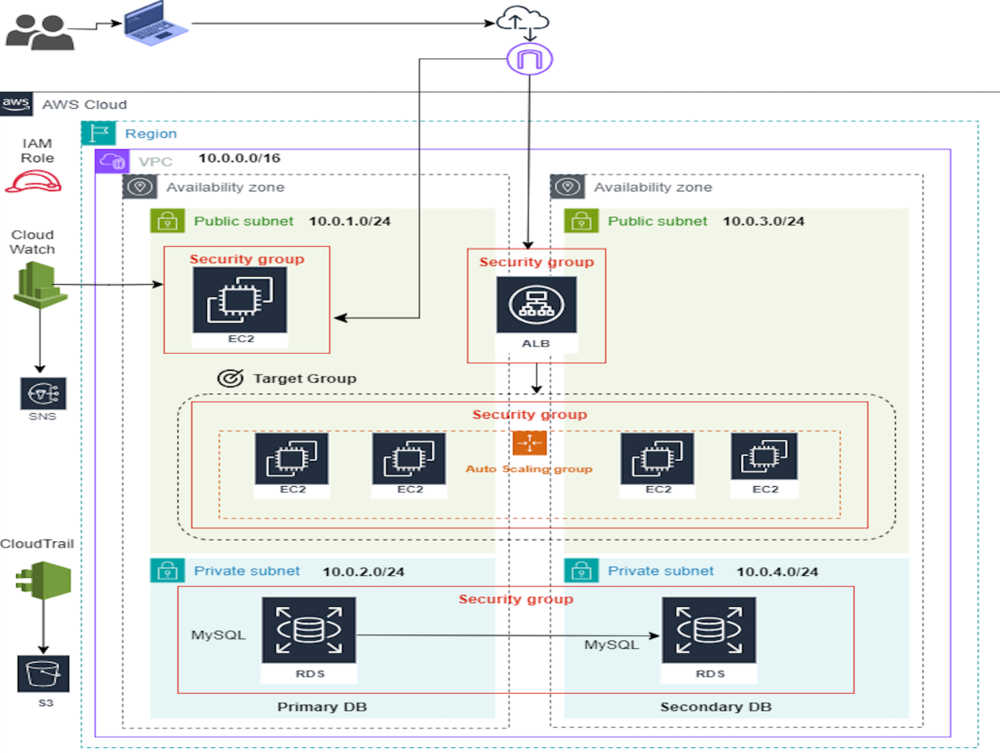

# What should be in the README.md file?

## 1. Project Title

Give your project a title that reflects its purpose and functionality.

Example:

#### Terraform AWS WordPress Deployment

Highly Available, Scalable WordPress Application on AWS using Terraform

## 2. Project Description

Provide a brief overview of what your project does, its goals, and its significance. Explain why someone would want to use it.

Example:

This project automates the deployment of a scalable and highly available WordPress application on AWS using Terraform. It includes:

- An EC2 Auto Scaling Group with a Launch Template
- Application Load Balancer (ALB)
- RDS (MySQL) database backend
- Security groups for access control
- VPC, subnets, and networking setup

## 3. Project Structure

Give a breakdown of the project structure. This can include directories, files, and their purposes. For example:

```
.
├── modules/
│   ├── ec2/
│   ├── rds/
│   ├── alb/
├── main.tf
├── variables.tf
├── outputs.tf
├── terraform.tfvars
├── README.md
```

## 4. Features

List the key features of your project. Highlight what makes it unique or useful.

- **Scalability**: Automatically scales the number of EC2 instances based on traffic load.

- **High Availability**: Deploys instances across multiple availability zones to ensure uptime.

- **Security**: Implements security groups and IAM roles to control access and permissions.
- **Database Integration**: Connects to an RDS MySQL database for data storage.

- **Infrastructure as Code**: Uses Terraform to manage and provision AWS resources, allowing for version control and easy replication of the environment.

- **Monitoring and Logging**: Integrates with AWS CloudWatch for monitoring and logging of application performance and errors.

## 5. Architecture Diagram

Include a diagram that illustrates the architecture of your project. By creating an AWS architecture diagram, you can visually represent the components and services involved in your project. This helps others understand how the different parts of your project interact with each other.



## 6. Installation Instructions

Provide step-by-step instructions on how to install and set up your project. Include any prerequisites, dependencies, or configurations needed.

Example:

Prerequisites:

- AWS account with IAM permissions to create resources
- Terraform installed on your local machine (https://www.terraform.io/downloads.html)
- AWS CLI configured with your credentials (https://docs.aws.amazon.com/cli/latest/userguide/getting-started-install.html)
- Basic knowledge of AWS services and Terraform
- Familiarity with the command line interface (CLI)

## 7. Usage Instructions

Explain how to use your project. Provide examples, code snippets, or screenshots to help users understand how to interact with it.

Example:

### Clone the repository:

```bash
git clone git@github.com:Kreyno93/Deham21Capstone.git
```

### Change into the project directory:

```bash
cd Deham21Capstone
```

### Configure AWS credentials:

Make sure your AWS credentials are configured. You can do this by running:

```bash
aws configure
```

This will prompt you to enter your AWS Access Key ID, Secret Access Key, region, and output format.

### Use the Terraform CLI to manage your infrastructure:

**Initialize Terraform**: Run the following command to initialize the Terraform working directory:

```bash
terraform init
```

**Plan the Deployment**: Generate and show an execution plan:

```bash
terraform plan
```

**Apply the Configuration**: Apply the changes required to reach the desired state of the configuration:

```bash
terraform apply
```

**Destroy the Infrastructure**: To remove all the resources created by Terraform, run:

```bash
terraform destroy
```
